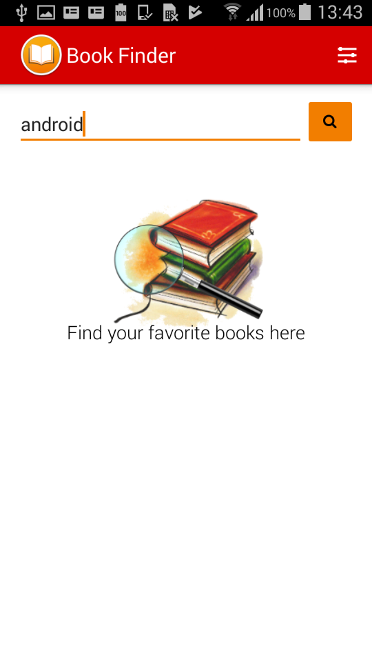
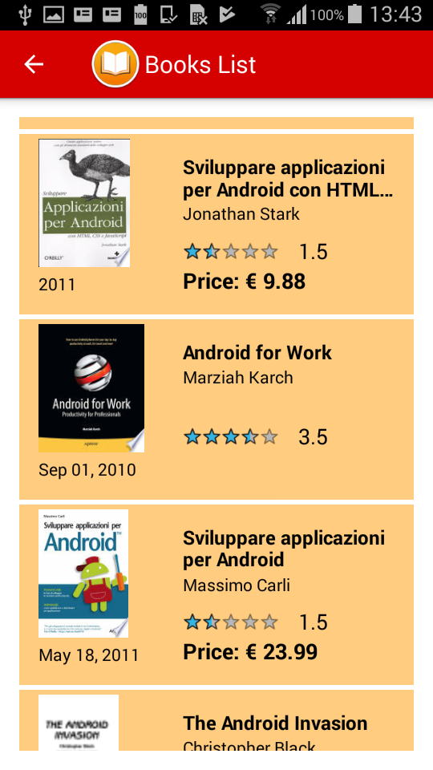

# Book-Listing-App
App created for Udacity.com in the course: Android Basics by Google Nanodegree Program

This app retrieves a list of books available on the Google Server, using the Google Books API.
You can use the research field for finding a specific book or use the advanced search for filter the results with Order By and Max Results.

Here some screenshot:

  
  

